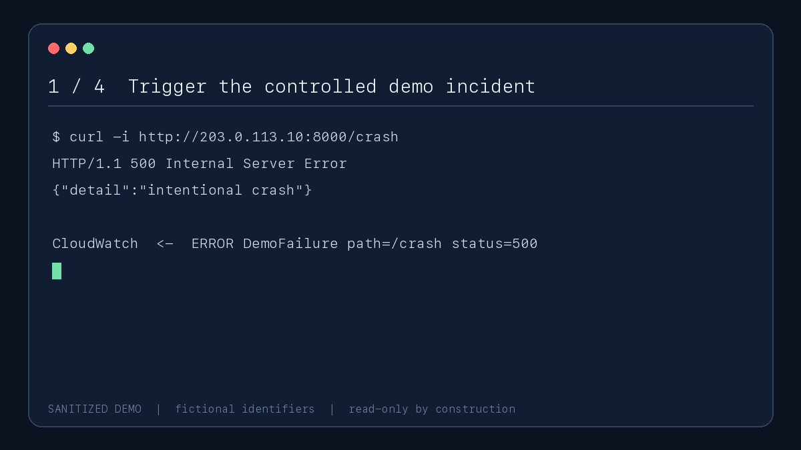
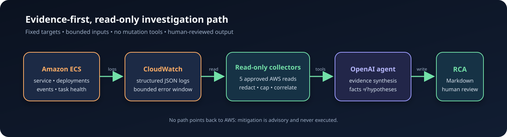

# AWS Incident Triage Agent

An evidence-first, read-only incident investigator for Amazon ECS. It gathers bounded ECS and
CloudWatch evidence, asks an OpenAI model to reason over that evidence, and writes a structured
root-cause analysis (RCA) without changing AWS resources.

> **Safety boundary:** the agent exposes exactly five AWS read actions and no mutation tools. It
> cannot restart tasks, scale services, deploy images, roll back, or delete infrastructure.

## Why this exists

Incident responders lose time switching among ECS events, task state, log streams, and deployment
history before they can form a testable hypothesis. This project turns those signals into one
bounded evidence bundle and an auditable Markdown RCA. Deterministic local code counts recurring
failure patterns; the model is responsible for synthesis, not inventing telemetry.

This is a portfolio/demo implementation, not an autonomous remediation system.

## Demo

The sanitized walkthrough below shows the intended operator flow: trigger the demo failure, run the
agent, collect evidence, and review the RCA. It contains fictional identifiers and makes no live AWS
or OpenAI calls.



See the complete [sanitized sample RCA](examples/sample-rca.md).

## Architecture



1. The demo service runs as an ECS Fargate task and emits structured JSON logs.
2. CloudWatch Logs retains application failures while ECS exposes service, deployment, event, and
   task health.
3. Bounded collectors call only the configured cluster, service, tasks, and log group.
4. Before evidence crosses the model boundary, common credential formats are redacted and message
   size, event count, pagination, and time windows are capped.
5. The agent uses the OpenAI Responses API with three custom tools: ECS status, recent errors, and
   deterministic failure-pattern analysis.
6. The output is checked for the required RCA sections and written as Markdown.

The function-calling loop follows the official OpenAI
[Responses API](https://developers.openai.com/api/reference/cli/resources/responses/methods/create).

## Threat model in one minute

AWS responses, service events, operator context, and logs are all treated as untrusted data. Prompt
injection in a log can influence prose, but it cannot add a tool or expand AWS permissions. There
are no destructive tools, collectors are target-bound and capped, and CI asserts that both code and
Terraform still contain only the five approved read operations.

Credential redaction is defense in depth, not a data-loss-prevention guarantee. Reports may retain
resource names, ARNs, log stream names, image digests, or incident details. Review every generated
report before sharing it. See [THREAT_MODEL.md](THREAT_MODEL.md) and [SECURITY.md](SECURITY.md) for
the full boundaries and disclosure process.

## IAM: exactly five permitted reads

The Terraform policy in
[`infrastructure/terraform/triage-iam.tf`](infrastructure/terraform/triage-iam.tf) grants only:

| AWS action | Evidence collected | Scope |
| --- | --- | --- |
| `ecs:DescribeClusters` | Cluster status and task counts | Demo cluster ARN |
| `ecs:DescribeServices` | Service, deployments, and recent service events | Demo service ARN |
| `ecs:ListTasks` | Task ARNs for the configured service | `Resource: "*"` (required by ECS), constrained by `ecs:cluster`; service fixed in code |
| `ecs:DescribeTasks` | Running, pending, and stopped task details | Tasks in the demo cluster |
| `logs:FilterLogEvents` | Recent error-like log events | Demo log group only |

There are no `Create*`, `Update*`, `Delete*`, `Run*`, `Stop*`, `ExecuteCommand`, `PassRole`, or
wildcard actions. `ListTasks` is the only wildcard resource because ECS does not support the cluster
as its resource type; the supported `ecs:cluster` condition binds it to the demo cluster. Attaching a
broader policy to the runtime identity would invalidate this security claim.

## Run locally

### Prerequisites

- Python 3.12
- AWS credentials from your normal identity provider; short-lived credentials are preferred
- An OpenAI API key exported as `OPENAI_API_KEY`
- Access to one ECS cluster/service and CloudWatch log group through the included IAM policy

Create an isolated environment and install the pinned agent dependencies:

```bash
python3.12 -m venv .venv
source .venv/bin/activate
python -m pip install --upgrade pip
python -m pip install -r triage-agent/requirements.txt
```

Configure the runtime. Do not put credentials in `.env`, Terraform variables, screenshots, or
incident reports:

```bash
export OPENAI_API_KEY="..."
export AWS_REGION="us-east-1"
```

First validate access and inspect exactly what would be sent for analysis. `--collect-only` makes no
OpenAI request:

```bash
python triage-agent/agent.py \
  --cluster buggy-service-cluster \
  --service buggy-service \
  --log-group /ecs/buggy-service \
  --lookback-minutes 180 \
  --collect-only \
  --output -
```

Then generate an RCA:

```bash
python triage-agent/agent.py \
  --cluster buggy-service-cluster \
  --service buggy-service \
  --log-group /ecs/buggy-service \
  --lookback-minutes 180 \
  --incident-context "Elevated 5xx responses began around 14:05 UTC"
```

The default output is `incidents/incident-<UTC timestamp>.md`. That directory is intentionally
ignored because reports are operational data. Use `--output -` for stdout or `--output PATH` for an
explicit destination. `OPENAI_MODEL` or `--model` overrides the default model; model access depends
on your OpenAI project.

## Demo infrastructure and flow

The Terraform demo provisions a deliberately small Fargate service. Follow
[`infrastructure/terraform/README.md`](infrastructure/terraform/README.md) to deploy it after
reviewing the plan.

1. Replace the non-routable example `allowed_ingress_cidrs` with your trusted `/32` or private CIDR.
2. Build and publish the `buggy-service` image for the configured CPU architecture.
3. Apply a reviewed Terraform plan and attach only the output read-only policy to the agent
   identity.
4. Call `/health`, then call `/crash` to emit a controlled HTTP 500 log event.
5. Run `--collect-only`, inspect the sanitized evidence, then run the agent.
6. Compare the generated RCA with [the sample](examples/sample-rca.md).
7. Destroy the demo stack when finished to avoid idle cost and public exposure.

Never aim the intentional failure endpoint at a production service.

## RCA contract

Every report has these sections in order: executive summary, customer and system impact, UTC
timeline, confirmed root cause (or an explicit unconfirmed statement), contributing factors,
mitigation and recovery, concrete evidence, corrective actions with owner/priority, detection gaps,
and ranked unverified hypotheses.

The model must collect ECS status and recent CloudWatch errors before concluding, then call the
deterministic pattern analyzer. Correlations remain hypotheses unless the evidence supports a causal
chain.

## Validation

GitHub Actions run only automated checks represented by the repository workflows:

- Ruff linting and import checks;
- unit tests, including an AST-based five-operation read-only contract;
- Python bytecode compilation;
- pip-audit checks for known vulnerabilities in both pinned runtime dependency sets;
- Terraform format and validation using pinned Terraform/provider versions; and
- Gitleaks against the full Git history with full checkout depth.

Run the local subset with:

```bash
python -m pip install \
  -r requirements-dev.txt \
  -r triage-agent/requirements.txt \
  -r buggy-service/requirements.txt
ruff check .
python -m unittest discover -s tests -v
terraform -chdir=infrastructure/terraform fmt -check -recursive
terraform -chdir=infrastructure/terraform init -backend=false
terraform -chdir=infrastructure/terraform validate
gitleaks git --redact
```

No status badges are included until the repository has a real GitHub owner/default branch and the
workflows have completed successfully.

## Limitations

- Evidence is limited to one configured ECS service and one CloudWatch log group.
- The agent does not query metrics, traces, CloudTrail, load balancers, application dependencies, or
  deployment pipelines.
- Event limits and lookback windows can omit older or high-volume evidence.
- Redaction is pattern-based and cannot guarantee removal of every secret or sensitive identifier.
- Model output can be incomplete or wrong; an operator must validate claims against cited evidence.
- The demo uses public task IPs (with explicitly restricted ingress), no load balancer, a single
  desired task, local Terraform state, and no production availability design.
- Read-only investigation does not mean zero side effects: AWS/OpenAI API calls incur normal audit
  events, quotas, latency, and possible cost.
- No mitigation is executed. Recommendations require a separate reviewed operational workflow.

## Repository layout

- `triage-agent/` — Python CLI, OpenAI investigation loop, prompts, and bounded AWS collectors.
- `buggy-service/` — intentionally fallible FastAPI demo service and container definition.
- `infrastructure/terraform/` — demo ECS stack and scoped read-only IAM policy.
- `tests/` — agent, redaction, collector, and read-only contract tests.
- `examples/` — sanitized output safe to review publicly.
- `docs/` — architecture and reproducible demo assets.
- `incidents/` — ignored local reports; never assume they are safe to publish.

## License

Released under the [MIT License](LICENSE).
